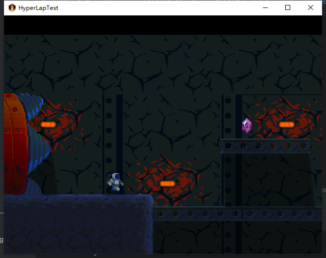

# HyperLapTest
HyperLap测试项目
使用gdx-liftoff生成的项目
使用HyperLap官方示例项目tutorial-space-platform里面的资源,地址为:https://github.com/rednblackgames/tutorial-space-platform
官方示例使用的是ashley实体框架,在这里我使用的是artemis-odb
预览图:

